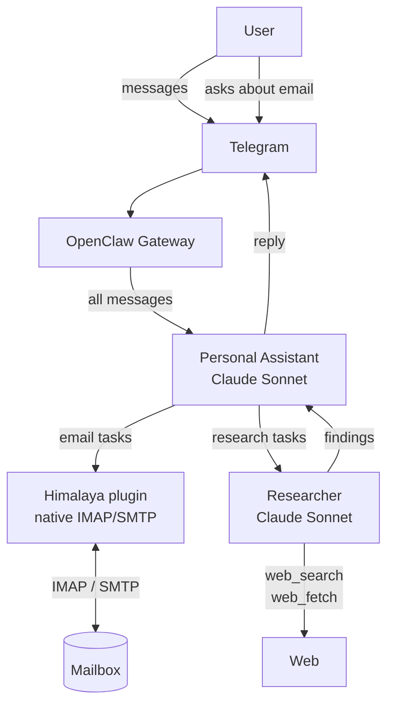
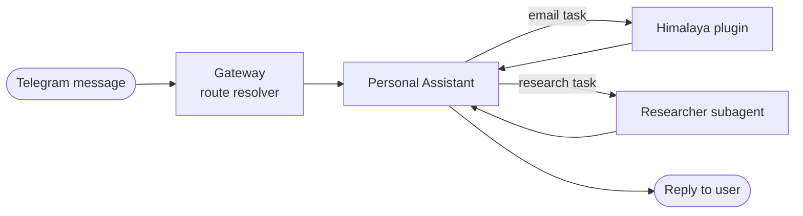
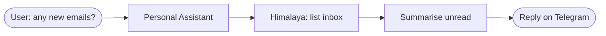
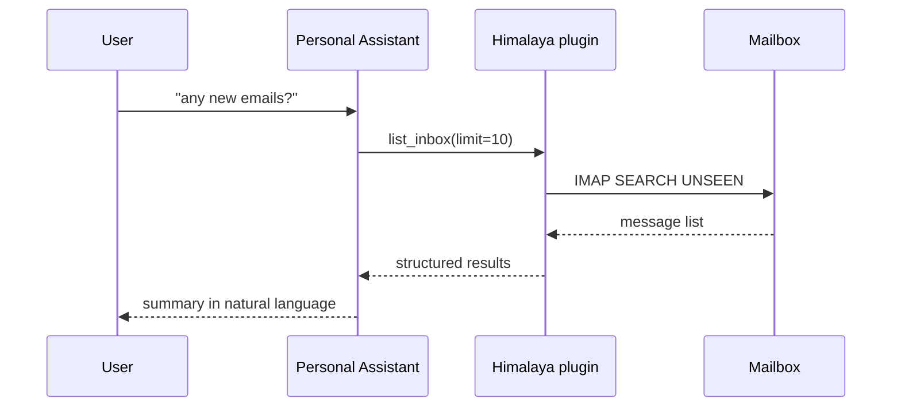
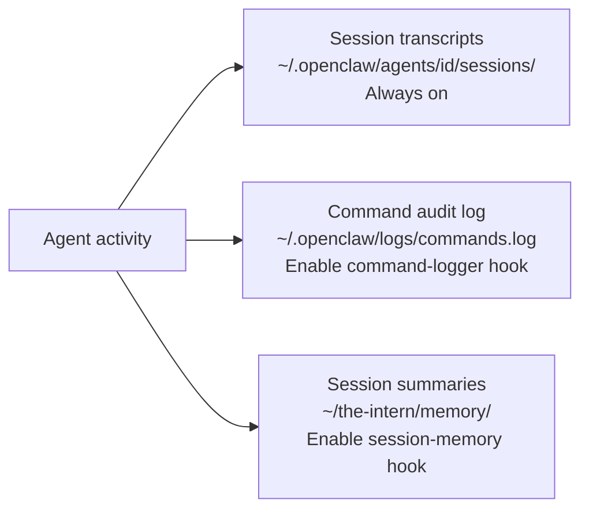

# The Intern — MVP Design Document

| | |
|---|---|
| **Date** | 2026-04-12 |
| **Status** | Draft |
| **Scope** | MVP — single user, minimal security, core features only |

---

## 1. Overview

The Intern is a personal AI assistant built on OpenClaw. It connects to the user through Telegram and business email, runs two specialised agents, and uses Claude Sonnet for both. Email is integrated through the built-in Himalaya plugin.

### Goals for MVP

- Receive and respond to messages via Telegram
- Read, search, send, and reply to business email (IMAP/SMTP)
- Delegate research tasks (web search, document lookup) to a specialised agent
- Keep all personal data within the Anthropic API; no third-party model providers
- Log all agent activity with zero custom code using built-in hooks
- Calendar and reminders integration

### Out of scope for MVP

- Web UI chat interface
- Multi-user support
- Advanced security (allowlist is the only guard)
- Approval flows for sensitive actions

---

## 2. Architecture



### Data flow — inbound Telegram message



### Data flow — checking email



> **Note:** Email is **pull-only** in the MVP. The agent reads email when asked; it does not push Telegram notifications on new arrivals. Push can be added later via a polling cron job or an IMAP IDLE watcher hook.

---

## 3. Components

| Component | Role | Built-in? |
|-----------|------|-----------|
| Telegram channel | Primary input/output | Native |
| Personal Assistant agent | Main agent, email + reminders | Native (config only) |
| Researcher agent | Web + document research | Native (config only) |
| Claude API | Model for both agents | Native plugin |
| Himalaya plugin | IMAP/SMTP email access | Native plugin |
| `command-logger` hook | Command audit log | Native, needs enabling |
| `session-memory` hook | Session summaries | Native, needs enabling |
| Session transcripts | Full conversation JSONL | Native, always on |

---

## 4. Agents

### 4.1 Personal Assistant

| Property | Value |
|----------|-------|
| Agent ID | `personal-assistant` |
| Model | Claude Sonnet (claude-sonnet-4-6) via Anthropic API |
| Channel binding | `telegram:main` (all messages) |
| Auto reply | Yes |
| Plugins | `himalaya` |

**Responsibilities:**
- Handle all Telegram conversations
- Read, search, send, and reply to business email via the Himalaya plugin
- Manage reminders (in-context, no external calendar for MVP)
- Delegate research requests to the Researcher subagent

**Behavioural rules:**
- Always confirm recipient and subject before sending or replying, unless the user explicitly says to proceed
- For any research task, spawn the Researcher instead of attempting it locally
- Prefer bullet points over paragraphs in summaries

### 4.2 Researcher

| Property | Value |
|----------|-------|
| Agent ID | `researcher` |
| Model | Claude (claude-sonnet-4-6) via Anthropic API |
| Channel binding | None (spawned as subagent only) |
| Auto reply | No |
| Tools | `web_search`, `web_fetch` |

**Responsibilities:**
- Web search and page retrieval
- Internal document lookup (later iteration)
- Return structured summaries: findings, sources, confidence level

**Output format (always):**
- Key findings — bullet points
- Sources — URLs
- Confidence — high / medium / low

---

## 5. Models

| Agent | Provider | Model | Reason |
|-------|----------|-------|--------|
| Personal Assistant | Anthropic | claude-sonnet-4-6 | Conversational, email, reminders |
| Researcher | Anthropic | claude-sonnet-4-6 | Stronger reasoning, better tool use |

**Why split if both use the same model?**
- Different tool sets: PA gets Himalaya; Researcher gets `web_search` and `web_fetch`
- Different channel bindings: PA is tied to Telegram; Researcher has none
- Different behavioural rules: PA confirms before sending; Researcher returns structured reports
- Keeps concerns cleanly separated and makes each agent independently replaceable

---

## 6. Email Integration

Email is handled by the **Himalaya plugin**, which ships with OpenClaw. It connects directly to the mailbox over IMAP/SMTP and exposes email tools to the agent — no custom script needed.

### 6.1 How Himalaya works in OpenClaw



**Key properties:**
- **Native** — no Python script or custom files to maintain
- **Tool-based** — Himalaya registers email tools directly with the agent (list, read, send, reply, flag)
- **Credential isolation** — IMAP/SMTP credentials are set in `.openclaw.yml` under the plugin config, not in the agent context
- **Confirmation policy** — the PA's system description instructs it to confirm recipients before sending; Himalaya enforces nothing itself

### 6.2 Workspace structure

```
~/the-intern/
├── BOOTSTRAP.md          ← runs at session start
└── memory/               ← session-memory hook outputs
```

With Himalaya as a native plugin there are no extra skill files or wrapper scripts to manage.

### 6.3 Himalaya plugin configuration

Credentials go in the `plugins` section of `.openclaw.yml`:

| Field | Purpose |
|-------|---------|
| `imap_host` / `imap_port` | IMAP server (default port 993, SSL) |
| `smtp_host` / `smtp_port` | SMTP server (default port 587, STARTTLS) |
| `username` | Login username |
| `password` | Reference to an env var holding the app password or OAuth token |
| `from` | Display name + address for outbound mail |

> Use an app-specific password or OAuth token — never your main account password. Reference it via an environment variable, not a literal string in the config.

### 6.4 Available email tools

Himalaya exposes these tools to the agent:

| Tool | What it does |
|------|-------------|
| `list_inbox` | Fetches N most recent messages with read/unread flag |
| `read_message` | Fetches a single message by ID; marks it as read |
| `search_messages` | Searches with filters: sender, recipient, subject, date range, free text |
| `send_message` | Sends a new message via SMTP |
| `reply_message` | Replies with correct threading headers (`In-Reply-To`, `References`) |
| `flag_message` | Marks a message as read or unread |

---

## 7. OpenClaw Configuration

The `.openclaw.yml` file wires everything together. Required sections:

| Section | What to set |
|---------|------------|
| **Profiles** | Anthropic API key from env var |
| **Models** | Default model: `claude-sonnet-4-6` |
| **Channels** | Telegram bot token from env var; allowlist = owner's Telegram user ID only |
| **Workspace** | Directory: `~/the-intern` |
| **Plugins** | Himalaya: IMAP/SMTP credentials (passwords via env vars) |
| **Hooks** | `command-logger: enabled`; `session-memory: enabled` (message window: 20) |
| **Agents** | `personal-assistant` — claude-sonnet-4-6/anthropic, telegram binding, auto-reply on, himalaya plugin enabled |
| | `researcher` — claude-sonnet-4-6/anthropic, no binding, web tools on |

---

## 8. Logging

Three layers are active once hooks are enabled:



| Layer | Captures | Format | Enabled by |
|-------|----------|--------|-----------|
| Session transcripts | Every message, tool call, tool result | JSONL per session | Always on |
| Command audit log | `/new`, `/reset`, `/stop` with timestamp, session, sender | JSONL append | `command-logger: true` |
| Session summaries | LLM-generated session summary at `/new` or `/reset` | Markdown file | `session-memory: true` |

---

## 9. Setup Sequence

```mermaid
gantt
    title Setup phases
    dateFormat  D
    axisFormat  Day %d

    section Day 1
    Phase 1 — Telegram + PA                :p1, 1, 1d
    Phase 2 — Email via Himalaya           :p2, after p1, 1d

    section Day 2
    Phase 3 — Researcher subagent          :p3, 3, 4h
    Phase 4 — Logging hooks                :p4, after p3, 1h
```



### Phase 1 — Telegram + PA (~30 minutes)

1. Add `ANTHROPIC_API_KEY` to your shell environment (e.g. `~/.profile`)
2. Create a Telegram bot via `@BotFather` — note the bot token
3. Find your Telegram user ID via `@userinfobot` — note the numeric ID
4. Create `.openclaw.yml` with the Anthropic profile, Telegram channel, and personal-assistant agent
5. Start the OpenClaw gateway
6. Send a message to your bot — verify the PA replies

### Phase 2 — Email via Himalaya (~15 minutes)

1. Obtain an app-specific password or OAuth token for your mail account
2. Add the Himalaya plugin block to `.openclaw.yml` with IMAP/SMTP settings (password from env var)
3. Enable the himalaya plugin for the `personal-assistant` agent
4. Reload the gateway
5. Ask the PA: "do I have any new emails?" — verify it lists the inbox

### Phase 3 — Researcher subagent (~15 minutes)

1. Add the `researcher` agent block to `.openclaw.yml` (reuses the same Anthropic profile)
2. Reload the gateway
3. Test: ask the PA to research something online

### Phase 4 — Logging hooks (~5 minutes)

1. Add the `hooks` block (command-logger + session-memory) to `.openclaw.yml`
2. Reload the gateway
3. Issue a `/new` command to trigger the first session-memory write
4. Verify the summary appears in `~/the-intern/memory/`

---

## 10. Decisions and Trade-offs

### Why two agents instead of one?

- Different tool sets: giving one agent all tools increases the risk of misuse (e.g. web-searching when it should just reply)
- Different behavioural rules: PA is conversational and confirms before acting; Researcher is analytical and returns structured reports
- Easier to tune and replace independently
- Subagent delegation is the natural OpenClaw idiom for task specialisation

### Why Himalaya instead of a custom email script?

| Approach | Effort | Maintenance |
|----------|--------|-------------|
| Custom Python CLI (`email-cli.py`) | Medium — write, test, maintain a script | Owner — any IMAP edge case is your problem |
| Himalaya plugin (built-in) | Zero — configure credentials only | OpenClaw team — updates come with the platform |

Himalaya is already integrated with OpenClaw's tool system, so the agent gets typed email tools with no glue code.

### Why pull-only email for MVP?

- Push requires IMAP IDLE (persistent connection) or a polling cron job
- Both add infrastructure complexity with no functional gain for MVP
- Can be added later as a standalone cron hook — no refactoring needed

### Why Claude Sonnet for both agents?

- Single API provider simplifies credentials and billing
- Sonnet has the reasoning quality needed for both email summarisation and web research
- Consistent behaviour and capability across agents makes the system easier to reason about
- Can be downgraded to Haiku on the PA later if cost becomes a concern

---

## 11. Future Iterations

| Feature | Approach |
|---------|---------|
| Email push notifications | IMAP IDLE watcher as a cron hook or standalone daemon |
| Calendar integration | CalDAV plugin (same pattern as Himalaya) |
| Internal document search | Researcher agent + local vector DB (LanceDB, built-in) |
| Web UI chat | Matrix channel (has web client) or custom channel plugin |
| Token/cost tracking | Plugin with `llm_output` hook → daily JSONL log |
| Second user | Add to Telegram allowlist; assign a separate agent binding |
| Approval flows | `before_tool_call` plugin hook for send/reply confirmation |
