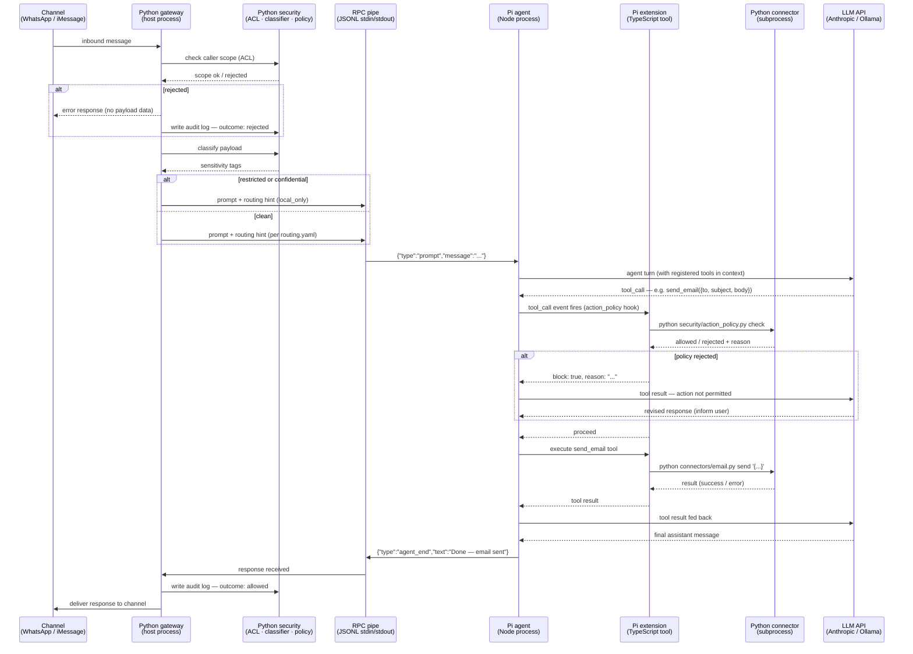

# Intern — system overview

**Version:** 0.2 (architecture + roadmap)
**Platform:** macOS (Apple Silicon) / Linux
**Runtime:** Native Python process — no container in v0.1
**Status:** Architecture draft

## Table of Contents

- [Purpose](#purpose)
- [Design principles](#design-principles)
- [Language boundary](#language-boundary)
- [Architecture layers](#architecture-layers)
  - [1. Interface layer](#1-interface-layer)
  - [2. Security layer](#2-security-layer)
  - [3. Orchestration layer](#3-orchestration-layer)
  - [4. AI model router](#4-ai-model-router)
  - [5. Connectors](#5-connectors)
- [Project layout](#project-layout)
- [Features](#features)
- [Roadmap](#roadmap)
- [OS setup checklist](#os-setup-checklist)
- [Security oversight summary](#security-oversight-summary)
- [Migration paths and future architecture](#migration-paths-and-future-architecture)
- [Future development roadmap](#future-development-roadmap)

-----

## Purpose

The Intern is a locally-hosted AI agent that interacts with an office environment on behalf of a user — reading and sending email, managing calendar events, and handling messaging channels. It operates with strict access controls, full auditability, and a security posture where sensitive data never leaves the local machine.

-----

## Design principles

- **Security is deterministic, not AI-driven.** Access control, data classification, and routing policy are enforced by static rules configured by a Sys Admin, never decided by an AI model.
- **Local by default.** All secrets, documents, logs, and models run on-device. Cloud API calls are opt-in per task and blocked entirely for sensitive data.
- **Native OS process first.** v0.1 runs directly on macOS or Linux with no container layer. This simplifies development, debugging, and access to OS-native APIs (Keychain, EventKit, Messages). Container isolation is a planned v0.2 upgrade.
- **Policy-driven execution.** Outbound actions are governed entirely by Sys Admin configuration and the Python security layer. There is no runtime human approval step — what is permitted is defined in `config.yaml` before the system runs.
- **Swappable models.** AI model selection is driven by a YAML routing config. Changing provider or model requires no code changes.
- **Process isolation as the v0.1 security boundary.** The security boundary is the OS user account. The Intern runs as a dedicated low-privilege user (`intern-svc`) with only the filesystem permissions it explicitly needs.
- **Designed for migration.** Every architectural boundary in v0.1 is drawn to make future migrations — from OpenClaw to Pi SDK, from native to containerised — low-cost changes at the integration layer only.

-----

## Language boundary

The stack is split between Python and Node/TypeScript. The split is deliberate and stable across all planned versions:

|Layer                                     |Language                             |Reason                                         |
|------------------------------------------|-------------------------------------|-----------------------------------------------|
|Interface (messaging channels)            |Node / TypeScript                    |OpenClaw and Pi extensions are TypeScript-only |
|Security (ACL, classifier, audit, secrets)|Python                               |No framework dependency — pure business logic  |
|Orchestration (agent loop)                |Node / TypeScript                    |Pi SDK (`createAgentSession`) is TypeScript    |
|AI router                                 |Node (Pi) or Python (LiteLLM sidecar)|Flexible — see router section                  |
|Connectors (email, calendar, doc index)   |Python                               |stdlib, `pyobjc`, `keyring` — all Python-native|

The only cross-language seam is the **RPC boundary**: Pi runs with `--mode rpc` and communicates with the Python security layer over a JSONL protocol on stdin/stdout. Pi’s official docs include a Python client example for exactly this integration pattern.

The Python security process is always the gatekeeper. It classifies and authorises every request before passing a prompt to Pi over the pipe. Pi never reads `config.yaml`, never touches the Keychain, and never calls a connector directly.

-----

## Architecture layers

### 1. Interface layer

Entry points into the Intern. All channels funnel into the same internal pipeline — security and orchestration logic is written once.

|Channel |Technology                      |Notes                                                                            |
|--------|--------------------------------|---------------------------------------------------------------------------------|
|iMessage|AppleScript / `imessage-cli`    |macOS only — direct native access                                                |
|WhatsApp|WhatsApp Business API (official)|Sends data to Meta — sensitive threads blocked at classifier                     |
|Email   |IMAP (read) / SMTP (send)       |Credentials stored in macOS Keychain or Linux Secret Service                     |
|Admin UI|FastAPI + minimal HTML          |Bound to `127.0.0.1` only — config management, audit log viewer, activity monitor|

In v0.1 the messaging connectors (iMessage, WhatsApp) are implemented as OpenClaw plugins or Pi extensions in TypeScript. The connector *business logic* (message parsing, send/receive) is kept in plain TypeScript classes with no framework imports, wrapped in a thin plugin registration file. This discipline is required for the OpenClaw → Pi migration path.

-----

### 2. Security layer

Enforced before any AI model call. All components are deterministic rule engines — no ML involvement. This layer is pure Python and has no dependency on the Node side of the stack.

#### 2a. OS user isolation

The Intern runs as a dedicated OS user (`intern-svc`) with minimal permissions:

- Read access to the documents folder only
- Read/write access only to `~intern-svc/data/`
- No sudo or admin privileges
- macOS: only the specific entitlements required (Mail, Calendar, Messages) granted via System Preferences, scoped to the specific Python binary

#### 2b. Sys Admin config (`config.yaml`)

A single YAML file, version-controlled, `chmod 600`, owned by `intern-svc`. **This file is read exclusively by the Python security layer.** The Node/Pi side of the stack never reads it. Any configuration the Node side needs (e.g. channel allowlists) is derived from this file by a startup script and written to the appropriate framework config format.

The file has four sections, each consumed by a different Python component:

```yaml
# consumed by: ACL checker
users:
  alice:
    scopes: [read:email, calendar:read]
  admin:
    scopes: ["*"]

api_keys:
  "key-abc123":
    identity: alice
  "key-xyz789":
    identity: admin

# consumed by: data classifier
sensitivity_rules:
  - pattern: "\\bIBAN\\b"
    tag: restricted
  - pattern: "\\bpassword\\b"
    tag: restricted
    match_field: body
  - pattern: "\\b[A-Z][a-z]+ [A-Z][a-z]+\\b"
    tag: confidential

# consumed by: RPC gateway (routing decision before Pi call)
routing_policy:
  restricted: local_only
  confidential: local_only

# consumed by: action policy enforcer (what the agent is permitted to do autonomously)
action_policy:
  allow: [send_email, send_whatsapp, create_event, delete_event]
  # Remove an action from allow to block it entirely.
  # Add constraints per action:
  send_email:
    max_recipients: 3
    allowed_domains: ["example.com"]   # empty = unrestricted
  send_whatsapp:
    allowed_contacts_only: true        # only contacts in the allow_from list

# derived by startup script → written to OpenClaw/Pi channel config
channels:
  whatsapp:
    allow_from: ["+34600000000"]
    block_sensitivity: [restricted, confidential]
  imessage:
    allow_from: ["alice@example.com"]
```

Config is loaded at startup and hot-reloaded on file change via `watchdog`. On every reload, the file’s modification timestamp and owning OS user are checked — an unexpected write is logged as a security event and surfaced in the Admin UI.

#### 2c. Secrets management

**macOS:** Secrets (email passwords, API keys, WhatsApp tokens) are stored in the macOS Keychain and accessed at runtime via the `keyring` Python library. Read into memory on demand — never written to disk or environment variables.

**Linux:** The `SecretService` API (GNOME Keyring / KWallet) via `keyring` with the same interface. On headless servers, `keyrings.alt` with an encrypted file backend is the fallback.

```python
import keyring
password = keyring.get_password("intern", "email_account")
api_key  = keyring.get_password("intern", "anthropic_api_key")
```

No `.env` files. No environment variables for secrets. No plaintext credentials anywhere in `config.yaml`.

> **Security note:** On macOS, Keychain access is granted per binary path. If the Python binary path changes (e.g. after a virtual environment update), macOS will re-prompt. Treat an unexpected re-prompt as a canary for binary path tampering.

#### 2d. ACL check

Every request is validated against the caller’s declared scope before its payload is read. A caller with `read:email` scope attempting `send:email` receives a 403 immediately. Static lookup — not AI logic.

#### 2e. Data classifier

The request payload is scanned against `sensitivity_rules` from `config.yaml`. Matches are tagged in memory. The original payload is not modified. Runs locally, always, before any model call or RPC send.

#### 2f. Audit log

Every request — including rejected ones — is appended to `~intern-svc/data/audit.db` (SQLite, WAL mode). The application layer permits `INSERT` only — no `UPDATE` or `DELETE` on the audit table.

|Field             |Content                                 |
|------------------|----------------------------------------|
|`timestamp`       |ISO 8601                                |
|`caller_id`       |Identity from API key                   |
|`action`          |Requested operation                     |
|`sensitivity_tags`|Tags found by classifier                |
|`model_used`      |Which model handled the request         |
|`policy_check`    |Which `action_policy` rule was evaluated|
|`outcome`         |`allowed`, `rejected`                   |


> **Security note:** Error responses must never include payload data or classifier output. A `400` that echoes a matched sensitivity pattern leaks classification to the caller.

-----

### 3. Orchestration layer

The agent loop runs inside the Node/TypeScript side of the stack, using the Pi SDK (`@mariozechner/pi-coding-agent`). The Python security layer feeds it prompts over the RPC pipe after classification and ACL checks pass.

Each capability (email read, email send, calendar lookup, doc search) is a Pi `AgentTool` defined in TypeScript. Tool *execution* calls back to Python connectors via subprocess — the TypeScript tool wrapper is kept as thin as possible.

#### Message flow sequence

The diagram below shows the full lifecycle of an inbound message from a channel (e.g. WhatsApp) through to a completed outbound action (e.g. sending an email reply). The RPC pipe is the boundary between the Python host and the Pi/Node process. Pi extensions operate entirely inside the Pi process.



**Key points illustrated by the diagram:**

- The Python gateway and security layer handle steps 1–4 entirely before Pi is involved. Pi never sees a rejected or unclassified request.
- The RPC pipe is crossed exactly twice per task: once inbound (prompt in) and once outbound (response out). Everything in between — LLM turns, tool calls, connector execution — happens inside Pi’s agent loop.
- Pi extensions operate inside Pi. The action policy hook (`tool_call` event) fires inside Pi’s loop and calls back to Python via subprocess. The TypeScript extension is thin — the policy logic lives in Python.
- Python connectors are always called as subprocesses from TypeScript extensions. They never receive data directly from the channel — only what Pi explicitly passes as tool parameters after the LLM has decided to act.
- The audit log is written by the Python gateway at the end of every request, whether it was rejected at the ACL stage, rejected by the action policy inside Pi, or completed successfully.

#### Action policy enforcement

Before any outbound tool call executes, the Python gateway checks the `action_policy` block in `config.yaml`. The check is deterministic: if the action is not in the `allow` list, it is rejected and logged. If it is allowed, any constraints (recipient limits, domain restrictions, contact allowlists) are evaluated against the tool call parameters. The agent never sees a rejection as an error — it receives a structured refusal response and can react accordingly (e.g. inform the user that the action is not permitted).

This replaces runtime human approval entirely. The Sys Admin defines what the agent may do before the system runs. Changing permissions means editing `config.yaml` and reloading — no code changes required.

#### Context and memory

The orchestrator has access to the document index for retrieving relevant files. No cross-session memory is persisted in v0.1. Conversation context is held in the Pi session file for the duration of a task only.

-----

### 4. AI model router

In v0.1, Pi’s built-in `getModel()` from `pi-ai` handles provider routing in Node. Alternatively, LiteLLM can run as a local HTTP proxy (OpenAI-compatible) on `localhost:4000`, and Pi is pointed at it via a custom model definition — this keeps routing logic in Python if preferred.

#### Routing config (`routing.yaml`)

```yaml
routes:
  classify:     ollama/mistral
  summarise:    claude-sonnet-4-20250514
  embed:        ollama/nomic-embed-text
  draft_email:  claude-sonnet-4-20250514
  quick_reply:  ollama/phi3
  sensitive:    ollama/mistral   # always local — overrides all above if data is tagged
```

#### Routing policy

1. If any sensitivity tag is present on the request → route to `sensitive` (local model), regardless of task type. This decision is made by the Python security layer *before* the RPC call.
1. Otherwise → look up task type in `routing.yaml` and dispatch.
1. Pi or LiteLLM handles retries and provider fallbacks.

#### Local model runtime

Ollama runs natively on Apple Silicon (Metal) and Linux (CPU or CUDA), installed independently.

|Model             |Use                                             |
|------------------|------------------------------------------------|
|`mistral`         |Classification, sensitive tasks, quick reasoning|
|`phi3`            |Fast short replies, low-latency tasks           |
|`nomic-embed-text`|Document embedding for index search             |

-----

### 5. Connectors

Pure Python. Thin, stateless adapters. Each connector only reads or writes what the orchestration layer explicitly requests. Connectors are called by TypeScript Pi tools via Python subprocess — they never receive data that has not passed the security gate.

#### Email

- Read: `imaplib` (Python stdlib)
- Send: `smtplib` (Python stdlib)
- Credentials fetched from Keychain at call time via `keyring`
- Attachments written to `~intern-svc/tmp/`, classifier-scanned, then immediately deleted

#### WhatsApp

- WhatsApp Business API (official) — not Baileys
- Outbound messages permitted only if `send_whatsapp` is in `action_policy.allow` and the recipient is in `channels.whatsapp.allow_from`
- Threads tagged `restricted` or `confidential` are read-only; sending blocked at ACL layer

> **Security note:** WhatsApp content is sent to Meta’s servers. The ACL layer — not the connector — is the enforcement point. The connector must never be trusted as a safety check.

#### Document index

- SQLite with FTS5 full-text search
- Stores metadata and file pointers only — never file contents
- Located at `~intern-svc/data/index.db`

```sql
CREATE TABLE documents (
  id           TEXT PRIMARY KEY,
  file_path    TEXT NOT NULL,
  title        TEXT,
  doc_type     TEXT,      -- email | contract | invoice | note
  author       TEXT,
  date         DATE,
  tags         TEXT,      -- JSON array
  sensitivity  TEXT DEFAULT 'normal',  -- normal | confidential | restricted
  summary      TEXT,      -- 2-3 sentence AI-generated summary
  fts_content  TEXT,      -- full text for FTS5
  embedding    BLOB       -- optional vector for semantic search
);
```

The `sensitivity` column is checked before any file path is passed to a model call. File paths are never forwarded to cloud models if `sensitivity != 'normal'`.

#### Calendar

- **macOS:** EventKit via `pyobjc` — direct native access
- **Linux:** CalDAV via `caldav` Python library
- Write operations permitted only if `create_event` / `delete_event` are in `action_policy.allow`

#### iMessage (macOS only)

- Send: AppleScript / `imessage-cli`
- Receive: polling `~/Library/Messages/chat.db` (read-only)

> **Security note:** Reading `chat.db` requires Full Disk Access in macOS System Preferences. Grant to the specific Python binary only; revoke if iMessage is not actively used.

-----

## Project layout

```
intern/
├── config.yaml              # Sys Admin ACL, rules, routing  [chmod 600]
├── routing.yaml             # Model routing config
├── requirements.txt         # Python deps
├── package.json             # Node deps (Pi SDK, OpenClaw)
│
├── security/                # Python — no Node dependency
│   ├── acl.py               # Scope enforcement
│   ├── classifier.py        # Sensitivity tagging
│   ├── audit.py             # Append-only SQLite log
│   └── config_loader.py     # YAML loader + file watcher
│
├── gateway/                 # Python — RPC bridge to Pi
│   ├── rpc_client.py        # stdin/stdout JSONL to Pi subprocess
│   └── action_policy.py     # Evaluates action_policy rules before tool execution
│
├── extensions/              # Node / TypeScript — Pi tools
│   ├── email_tool.ts        # Calls email.py via subprocess
│   ├── whatsapp_tool.ts     # Calls whatsapp.py via subprocess
│   ├── calendar_tool.ts     # Calls calendar connector via subprocess
│   └── doc_index_tool.ts    # Calls doc_index.py via subprocess
│
├── connectors/              # Python — pure business logic
│   ├── email.py             # IMAP / SMTP
│   ├── whatsapp.py          # WhatsApp Business API
│   ├── imessage.py          # AppleScript / chat.db (macOS only)
│   ├── calendar_mac.py      # EventKit via pyobjc
│   ├── calendar_caldav.py   # CalDAV (Linux)
│   └── doc_index.py         # SQLite FTS5
│
├── api/
│   └── admin_ui.py          # FastAPI — 127.0.0.1:8080
│
└── data/                    # Runtime data — not in version control
    ├── index.db
    └── audit.db
```

-----

## Features

List of desired features:

- Have different channels for communication with the bot:
  - iMessage, Telegram or Wahtsapp.
  - email
- The bot receives income email and acts on it.
  - The user can filter what email is received by the bot.
  - The user can configure how to deal with the emails depending on the sender.
- The bot finds information and relevant documents in Dropbox or local filesystem.
- The user can configure the paths and the location of the files.
- The user can switch between AI agent models.
- The user can use API access agents and local agents alike.
- The user can receive requests that are directly piped to the AI agent provider API without previous preprocessing.

- Web UI?
- Asvisor role?
- Social media account manager?
- Translation?

-----

## Roadmap

1. Initial version and Minimum Viable Product (MVP):
  - Communication via instant messages with the bot.
  - Local account user with system level restrictions.
  - User email account receive and send access, limited at system configuration to the user whitelisted email list.
  - Agent level customization (skills, sould.md, agents).

-----

## OS setup checklist

1. Create dedicated OS user: `sudo useradd -m intern-svc`
1. Set filesystem permissions: `intern-svc` read-only on documents folder, read/write only on `~intern-svc/data/`
1. Store all secrets: `python -c "import keyring; keyring.set_password('intern', 'email_account', '...')"`
1. Secure config: `chmod 600 config.yaml && chown intern-svc config.yaml`
1. macOS only: grant Mail, Calendar, Messages entitlements to the specific Python binary in System Preferences → Privacy
1. Start Ollama: `ollama serve` and pull required models
1. Start the Intern: `python gateway/rpc_client.py`; Admin UI (audit log, activity monitor, config reload) at `http://127.0.0.1:8080`

-----

## Security oversight summary

|Risk                                            |Mitigation                                                                              |
|------------------------------------------------|----------------------------------------------------------------------------------------|
|Intern process has broad OS permissions         |Run as dedicated `intern-svc` user with minimal filesystem grants                       |
|macOS Full Disk Access for iMessage             |Grant to specific Python binary only; revoke if iMessage not in use                     |
|WhatsApp sends data to Meta                     |Block sensitive/confidential threads at ACL layer before connector is called            |
|Secrets in `.env` files or environment variables|Prohibited — all secrets via `keyring` + OS Keychain / SecretService                    |
|`config.yaml` readable by other users           |`chmod 600`, owned by `intern-svc`                                                      |
|`config.yaml` modified unexpectedly             |File watcher logs modification timestamp and OS user; alerts Admin UI                   |
|API key with overly broad scope                 |Admin UI enforces minimal-scope key creation; wildcard scopes require explicit override |
|Audit log tampered with                         |SQLite WAL mode; `INSERT` only enforced at application layer                            |
|Error messages leaking classified content       |`400`/`403` responses never include payload data or classifier output                   |
|Rate limiting absent                            |Per-key rate limits enforced at ACL layer                                               |
|Admin UI exposed on network                     |Bound to `127.0.0.1:8080` only                                                          |
|Webhook endpoints unauthenticated               |All inbound webhooks require HMAC signature validation                                  |
|macOS Keychain re-prompt after binary change    |Treat as canary — log and alert                                                         |
|Config leaking into Pi prompts                  |Python gateway must never pass config values, file paths, or secrets into the RPC prompt|

-----

## Migration paths and future architecture

This section documents planned migrations and the design decisions in v0.1 that make them low-cost.

### OpenClaw → Pi SDK direct

**When:** When the OpenClaw trust model and personal-assistant assumptions create friction with the Sys Admin ACL and action policy requirements, or when custom action policy enforcement is difficult to hook cleanly into OpenClaw’s plugin lifecycle.

**What changes:**

|Component         |v0.1 (OpenClaw)             |v0.2 (Pi SDK direct)             |
|------------------|----------------------------|---------------------------------|
|Interface layer   |OpenClaw gateway + plugins  |Pi extensions (`registerTool`)   |
|Channel connectors|`OpenClawPluginApi` wrappers|Pi `AgentTool` wrappers          |
|Orchestration     |OpenClaw embeds Pi SDK      |Python spawns Pi directly via RPC|
|Action policy     |Python `action_policy.py`   |Unchanged                        |
|Security layer    |Unchanged                   |Unchanged                        |
|Connectors        |Unchanged                   |Unchanged                        |
|AI router         |Unchanged                   |Unchanged                        |

**What survives unchanged:** layers 2 and 5 entirely — the Python security layer, config loader, classifier, audit log, secrets management, and all connector business logic. The RPC protocol between Python and Pi is already in use in v0.1, so the Python gateway code also survives.

**What must be rewritten:** the TypeScript channel connector wrappers (one file per channel, ~50–100 lines each). The *logic* inside those connectors (WhatsApp message parsing, iMessage polling) is preserved — only the plugin registration changes from `OpenClawPluginApi` to `pi.registerTool()`.

**Key discipline to maintain in v0.1:** connector business logic must never import from `OpenClawPluginApi` or `openclaw/*`. Only the thin wrapper file at the top of each extension touches the framework. This makes the migration a find-and-replace on wrapper files, not a refactor of logic.

**WhatsApp credential note:** OpenClaw’s WhatsApp uses the Baileys library with QR-code pairing, storing credentials in `~/.openclaw/credentials/`. The official WhatsApp Business API (used in Pi direct) has a different auth flow. Re-authentication is required when migrating — plan for a brief service interruption on that channel.

-----

### Native process → Pi in a container (sandbox isolation)

**When:** When the risk profile of Pi having read/write access to the host filesystem is unacceptable, or when a stricter audit boundary is required.

**What changes:**

The Python security process remains on the host unchanged. The only change is how it spawns the Pi subprocess:

```python
# v0.1 — Pi runs on the host
proc = subprocess.Popen(
    ["pi", "--mode", "rpc", "--no-session"],
    stdin=subprocess.PIPE, stdout=subprocess.PIPE,
)

# v0.2 — Pi runs in a container
proc = subprocess.Popen(
    ["docker", "run", "--rm", "-i",
     "--network", "none",      # no outbound network
     "--read-only",            # no filesystem writes
     "--tmpfs", "/tmp",        # only writable mount
     "--cap-drop", "ALL",
     "intern-pi:latest",
     "pi", "--mode", "rpc", "--no-session"],
    stdin=subprocess.PIPE, stdout=subprocess.PIPE,
)
```

Pi’s container image contains only the Pi runtime and Node. No config files, no credentials, no document access, no network. All LLM API calls and connector calls travel back through the pipe to the Python host, which decides whether to execute them.

**What the container cannot see:**

- `config.yaml` and `routing.yaml`
- The Keychain / secrets store
- `index.db` and `audit.db`
- The documents folder
- Any connector or network endpoint

**Additional work required for containerisation:** in v0.1, Pi calls LLM APIs directly. In the containerised model (`--network none`), Pi cannot reach external APIs. Every model call must return via a tool call through the pipe, which the Python host intercepts and forwards to the appropriate API. This requires a proxy tool definition in Pi and a corresponding Python handler on the host. Plan this work before containerising.

**Design discipline to maintain in v0.1 for a smooth migration:** the Python gateway must never pass config values, file paths, or secrets into the RPC prompt or tool results. If Pi receives file paths via the prompt today, it will try to read them in the container tomorrow and fail. Keep the boundary clean from the start.

-----

## Future development roadmap

### Near term (v0.2 / v0.3)

**Document ingestion pipeline.** A folder watcher (`watchdog`) that monitors a designated documents directory, extracts text, generates AI summaries and embeddings, and registers each document in `index.db` with the correct `sensitivity` tag. Includes a manual tagging UI in the Admin panel and a re-index command.

**Pi sandbox (containerised orchestrator).** As described above — move the Pi process into a Docker container with `--network none`. Prerequisite: LLM API proxy tool on the host side.

**`launchd` / `systemd` service.** Run the Intern as a background daemon that starts on boot as `intern-svc`. Includes a log rotation cron and a health-check endpoint on the Admin UI.

**Rate limiting.** Per-key request rate limits enforced at the ACL layer. Configurable in `config.yaml` per user scope.

-----

### Medium term (v0.4 / v0.5)

**OpenClaw → Pi SDK migration.** Replace the OpenClaw gateway with direct Pi SDK usage (`createAgentSession`). Rewrite channel connector wrappers from `OpenClawPluginApi` to `pi.registerTool()`. Migrate WhatsApp from Baileys to the official Business API. The Python security and connector layers are unchanged.

**Telegram connector.** Add Telegram as a messaging channel via the official Bot API. Low effort once the OpenClaw → Pi migration is complete, as Telegram is a first-class Pi/OpenClaw channel.

**Voice interface (STT/TTS).** Add speech-to-text input (Whisper, local via `whisper.cpp`) and text-to-speech output (System TTS on macOS or a local model). Expose as an additional interface channel alongside iMessage and WhatsApp.

**Multi-account email.** Support multiple IMAP/SMTP accounts (personal + work) with per-account sensitivity rules and routing policies in `config.yaml`.

-----

### Longer term (v1.0+)

**Cross-session memory.** Persistent memory across sessions using a vector store (ChromaDB or Qdrant, local). Stores contact preferences, recurring task patterns, and writing style. Fed into Pi’s context on session start via the extension `before_agent_start` hook.

**LoRA fine-tuning for writing style.** Train a small LoRA adapter on outgoing emails to capture writing style. Used for email drafts and message composition. Requires a fine-tuning pipeline (dataset extraction from sent mail, training script, adapter management in `routing.yaml`).

**Multi-user support.** Per-user context isolation — separate Pi sessions, separate document index partitions, separate audit log rows keyed by user identity. Requires the containerised Pi model (one container per session) and a session manager in the Python gateway.

**Linux headless secrets.** Evaluate `keyrings.alt` with an encrypted file backend for Linux servers without a desktop session. Document the key derivation strategy and backup procedure.

**Proactive agent behaviour.** Allow the Intern to initiate actions on a schedule (daily briefing, meeting preparation) rather than only responding to inbound messages. Requires a cron-like scheduler in the Python gateway and a dedicated `proactive_actions` section in `config.yaml` listing which scheduled actions are permitted.

-----

*Document maintained alongside the codebase. Update this file when architecture decisions change.*