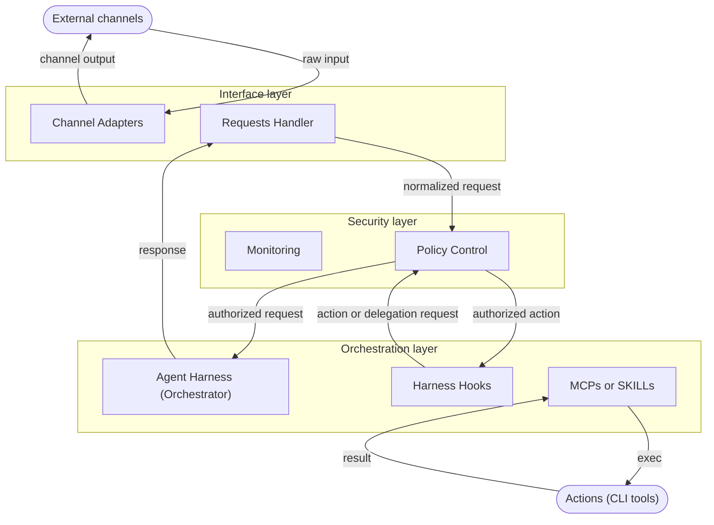

# Intern — system overview

## Table of Contents

- [Purpose](#purpose)
- [Design principles](#design-principles)
- [Architecture](#architecture)
  - [Layered view](#layered-view)
  - [Component interaction](#component-interaction)
  - [Components](#components)
    - [Requests Handler](#requests-handler)
    - [Policy Control](#policy-control)
    - [Agent Harness (Orchestrator)](#agent-harness-orchestrator)
    - [Actions](#actions)
    - [Monitoring](#monitoring)

-----

## Purpose

The system is a logically defined architecture for coordinating user interactions, policy enforcement, agent orchestration, memory, and model selection. It describes the structural responsibilities of the system without binding them to a particular implementation framework.

-----

## Design principles

- **Deterministic policy first.** Authorization, routing, and action limits are enforced by explicit rules rather than by model judgment.
- **Local-first privacy.** Sensitive information stays within controlled boundaries unless a component is explicitly permitted to process it externally.
- **Least privilege.** Each agent, channel, and tool receives only the permissions required for its role.
- **Modularity.** Interface handling, policy enforcement, orchestration, memory, and model selection remain separable.
- **Replaceability.** Concrete components may change over time without changing the underlying architectural contract.
- **Traceability.** Significant decisions and actions are recorded so the system can be inspected after the fact.

-----

## Architecture

### Layered view

```text
+------------------------------------------------------------+
| External channels                                          |
| User messages, notifications, queued tasks                 |
+------------------------------+-----------------------------+
                               |
                               v
+------------------------------------------------------------+
| Requests Handler                                           |
| Normalizes requests and attaches sender/channel context    |
+------------------------------+-----------------------------+
                               |
                               v
+------------------------------------------------------------+
| Monitoring and Policy control                              |
| Enforces identity, data boundaries, permissions, audit     |
+------------------------------+-----------------------------+
                               |
                               v
+------------------------------------------------------------+
| Agent Harness (Orchestrator)                               |
| Assigns roles, manages context, delegates bounded subtasks |
| Selects permitted models according to role and task needs  |
+------------------------------+-----------------------------+
                               |
                               v
+------------------------------------------------------------+
| Monitoring and Policy control                              |
| Log everything that comes out from the agent               |
+------------------------------------------------------------+
                               |
                               v
+------------------------------------------------------------+
| Actions                                                    |
| Interactions with external tools                           |
+------------------------------------------------------------+
```

The layers form a request path: each layer hands a more constrained, better-contextualized request to the next. **Monitoring** sits alongside this path rather than within it — every component writes to it. **Actions** is reached from the Agent Harness for permitted side effects.

### Component interaction

The diagram below shows the components grouped by layer and the paths between them. Solid arrows are the request and response path; dashed arrows are the records every component sends to Monitoring.



Two paths pass through **Policy Control**: it checks each request on the way in, and it checks again when the Agent Harness asks to run an action or delegate a subtask. This keeps authorization deterministic at every state-changing step rather than only at the entry point.

### Components

Each component has a single, clearly bounded responsibility. Components are logical roles, not implementation choices.

#### Requests Handler

Receives inputs from one or more external channels and normalizes them into a common internal request format. A channel may be synchronous, such as interactive chat, or asynchronous, such as email or a queued notification.

Responsibilities:

- Accept inbound user messages and requests.
- Normalize channel-specific payloads into a shared internal representation.
- Associate each request with a sender, a channel, and a conversational or transactional context.

#### Policy Control

Defines which actors may interact with which resources and under what conditions. It is deterministic and independent of model output, and it is consulted both when a request enters the system and when an agent later requests an action or a delegation.

Responsibilities:

- **Identity and access.** Evaluate every request against explicit identity and access rules, distinguishing the sender, the channel, and the agent or role permitted to receive it.
- **Data boundaries.** Classify data by sensitivity and intended scope, and decide which component may access which data.
- **Action permissions.** Constrain outbound actions by role, separating read-only operations, state-changing operations, external side effects, and privileged operations.

Access decisions are based on explicit policy, not on inference. An action may be blocked here even if an agent can technically describe it.

#### Agent Harness (Orchestrator)

Coordinates request handling, role assignment, delegation, and lifecycle state.

Responsibilities:

- Assign each request to the appropriate agent role.
- Delegate bounded subtasks from the primary agent to specialist agents.
- Select a permitted model for each role or task, from the models the Policy Control allows for that task's sensitivity.
- Track the lifecycle state of in-progress requests, including those that span asynchronous channels.


#### Actions

Performs the side effects an agent requests, limited to operations the Policy Control has authorized for that agent's role. It is the only component that produces external effects.

#### Monitoring

Records enough information to reconstruct what happened during a session or task. Every component writes to it; it is a structural requirement, not an optional add-on.

Monitoring captures the incoming request, the routing decision, the action or tool invocation, the result or failure, and any policy decision that constrained the action.
