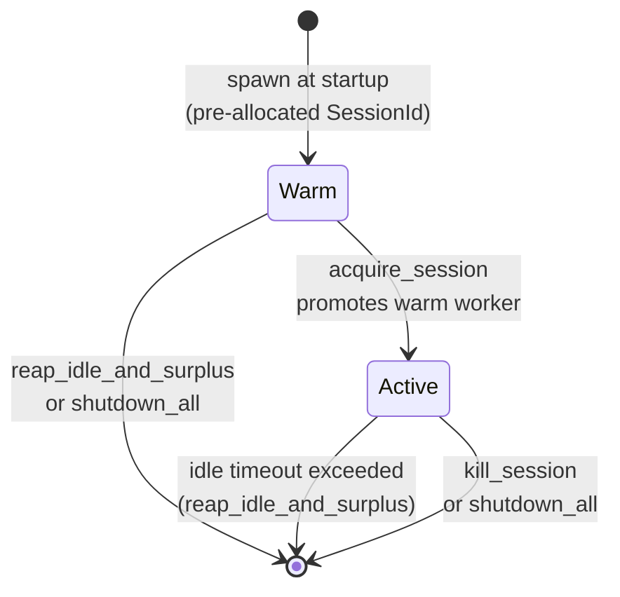

# Architecture Overview

This chapter is for readers who want to understand how `bob` is structured without
reading the Rust source. It answers the question: *what is running, and how does a
request move through it?* It is the shipped, user-facing summary of the service
design; the internal architecture notes stay in the development tree and are not
part of the release documentation bundle.

Operational topics — how to install, configure, and run `bob` — are in the
[Operator & Deployer Guide](../operator-guide/index.md). End-user topics are in the
[End-User Guide](../end-user-guide/index.md).

---

## System Shape

`bob serve` is a single, long-running Rust process. It hosts every deterministic
component — the request queue, the pre-flight admission gate, the policy engine, and
the audit log. It does not do the agentic work itself; that belongs to supervised
pi-agent child processes.

At startup `bob serve` binds two Unix-domain sockets:

| Socket | Audience | Purpose |
|---|---|---|
| `admin.sock` | Operators and `bob` CLI subcommands | Service control, chat subscription, audit tailing, policy reload |
| `extension.sock` | The JS extension inside each pi-agent process | Authorization verdict requests and agent event forwarding |

These two sockets have different trust profiles and evolve independently. `admin.sock`
uses JSON-RPC 2.0; `extension.sock` carries the authorization and event-forwarding
protocol from S-001.

Internally `bob serve` uses an **in-process bounded request queue** to decouple the
channel adapters from the Requests Handler. Each bounded channel is a typed
backpressure point — a full queue is observable, not a silent stall.

Persistence in v1 is **in-memory** for the inbound queue and session state. The audit
log is the only durable store (an append-only JSONL file on disk).

---

## Request Lifecycle

Every request — regardless of which channel it arrives on — follows the same path
through `bob serve`.

```mermaid
sequenceDiagram
    actor User
    participant CA as Channel Adapter
    participant Q as Request Queue
    participant RH as Requests Handler<br/>(pre-flight)
    participant SUP as pi-agent Supervisor
    participant PI as pi-agent Process
    participant EXT as JS Extension<br/>(tool_call hook)
    participant POL as Policy Engine<br/>(action gate)

    User->>CA: inbound message
    CA->>Q: submit Sync InternalEvent + RequestContext
    Q->>RH: dequeue
    RH->>RH: evaluate_admission(sender)
    alt sender not admitted
        Note over RH: drop event; write denial verdict to audit log
    else sender admitted
        RH->>SUP: route prompt to session
        SUP->>PI: send_prompt over runRpcMode JSON-RPC
        PI->>EXT: tool_call fires
        EXT->>POL: Authz{session, tool, args} on extension.sock
        POL-->>EXT: AuthzVerdict (allow / block)
        alt block or timeout
            EXT-->>PI: deny tool call
        else allow
            PI->>PI: execute tool (bash)
        end
    end
```

The most important properties of this path are:

- **Authorization is deterministic and outside the agent.** Both the pre-flight and
  the action gate are evaluated in the Rust service, against explicit rules that the
  agent cannot see or modify.
- **A pre-flight denial stops the request before any agent work begins.** The
  pi-agent process is never involved.
- **A tool-call denial stops the side effect while the session continues.** The agent
  receives a block verdict and can decide what to do next.

---

## Supervision

The pi-agent supervisor manages a pool of pi-agent child processes. It has two
lifecycle goals: absorb spawn latency with a pre-warmed pool, and bound resource use
by reaping idle sessions.



**Warm workers** are spawned at startup (and replenished after promotion) up to the
configured warm-pool size. Each warm worker is assigned a `SessionId` at spawn time;
when it is promoted to active the same id is used for all subsequent operations.

**Active workers** handle exactly one user session. The supervisor tracks
`last_prompt_activity` per active worker. Workers that have not received a prompt
within the configured idle-reap timeout are terminated on the next reap tick.

**Prompt delivery** uses pi-agent's `runRpcMode()` JSON-RPC channel. The supervisor
sends a JSON-RPC prompt command and reads the response from the child's stdout.

The supervisor is not a gateway — it does not enforce policy and does not see the
content of prompts. Its role is purely process lifecycle: spawn, promote, route
prompts, and reap.

**Relationship to `bob serve`**: the supervisor actor starts alongside all other
subsystem actors when `bob serve` starts. On graceful shutdown (SIGTERM or SIGINT),
`bob serve` first drains the non-supervisor actors, then awaits the supervisor's
`shutdown_all`, which terminates all active and warm workers.

---

## Channel Adapters

A channel adapter is the only component that knows anything channel-specific. Its job
is to normalize inbound traffic into a delivery-kind-typed `InternalEvent` plus a
`RequestContext` (sender identity, channel id, optional context id), then submit the
pair through the **channel intake handle** — the single sanctioned doorway into the
bounded request queue.

The core never enumerates channel types. An emailed request, a chat message, and a
scheduled trigger all look identical once they leave the adapter.

**Interactive-chat adapter** is the one implemented adapter. It consumes `admin.sock`
chat subscriptions: when a `bob chat` client opens a chat subscription, the admin-RPC
actor hands each user-input frame to the chat adapter, which normalizes it into a
`Sync`-kind request and submits it through the intake handle.

The following adapters are **not yet implemented**: email and scheduler.
Each is planned for its own specification, reusing the intake handle and configuration
schema established by S-006. See the
[Extension & Channel-Adapter Author Guide](../extension-author-guide/index.md) for
guidance on building adapters.

---

## Policy Gate

There are two policy checkpoints — both evaluated by the same pure `PolicyEngine`
against the same in-memory ruleset snapshot.

**Pre-flight admission** runs in the Requests Handler, before any agent is involved.
It answers: *is this sender allowed to submit requests at all?* The ruleset is an
explicit allow-list of `UserId`s. A denial drops the event, writes a denial verdict to the audit log, and never touches pi-agent.

**Blocking tool-call authorization** runs when a supervised agent is about to execute
a tool. The JS extension's `tool_call` hook intercepts every `bash` invocation and
sends an `Authz` request (session id, tool name, arguments) over `extension.sock`.
The `extension-ipc` actor evaluates `(tool, arguments)` against the action allow-list
and routes an `AuthzVerdict` back. The extension awaits the verdict under a bounded
timeout; if no verdict arrives or the transport fails, it **fails closed** (block).

The key conceptual distinction:

| | Pre-flight admission | Tool-call authorization |
|---|---|---|
| **When** | On every inbound request, before agent work | On every tool call, mid-session |
| **What is checked** | Sender identity | Tool name + arguments |
| **What a denial does** | Drops the request, no agent involved | Blocks the tool call; session continues |
| **Who evaluates** | Requests Handler (in the Rust service) | `extension-ipc` actor (in the Rust service) |

Because the agent runs inside a supervised child process and the extension is a thin
courier with no policy logic, neither the agent nor the extension can influence the
verdict or observe the ruleset.

Operators can reload the ruleset without restarting `bob` using the `policy.reload`
admin-RPC method.

---

## Monitoring

Monitoring in `bob` has two parts: a **durable audit log** and a **live tail stream**.

### Audit log

Every significant event is written to an append-only JSONL file. Each line is a
canonical `AuditRecord` envelope with a `kind`, a timestamp, an optional session id,
and a kind-specific payload. Three kinds of record are produced:

- **`event`** — forwarded from the JS extension (pi-agent turns, tool calls, results,
  failures).
- **`verdict`** — emitted by the pre-flight and tool-call authorization paths
  (allow or deny decisions).
- **`report`** — submitted by external action CLIs via `report.submit` on `admin.sock`.

Records are appended even when a live subscriber is not filtering for that kind. The
durable log is never filtered — it is a complete trail.

### Live tail and report submission

**`bob audit tail`** subscribes to the `audit.tail` admin-RPC method. The Monitoring
actor fans out matching future records to all connected subscribers. Operators can
narrow the stream to one or more kinds using `--filter`.

**`report.submit`** lets an external action CLI register the outcome of an action it
performed. The CLI connects to `admin.sock` (same-UID filesystem-permission gate), sends
a structured JSON report, and the Monitoring actor validates and appends it.

All three sources feed through the same normalization path: the Monitoring actor
wraps each input into the canonical envelope before writing to disk or delivering to
subscribers.

For the operational walkthrough of `audit tail` and log configuration, see the
[Operator & Deployer Guide](../operator-guide/index.md). For the `report.submit`
contract from an extension author's perspective, see the
[Extension & Channel-Adapter Author Guide](../extension-author-guide/index.md).
