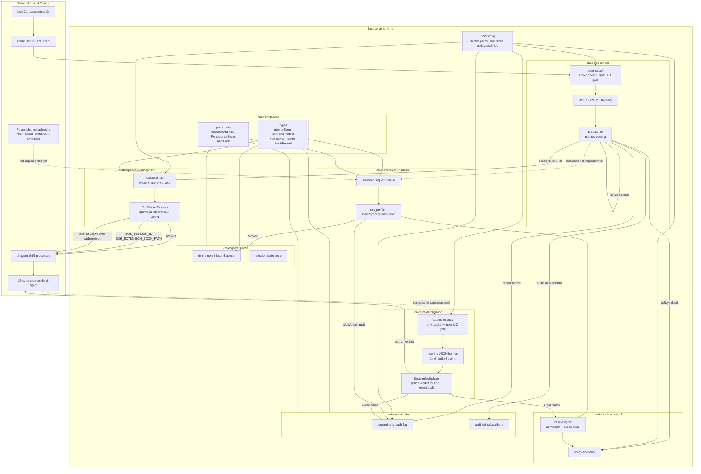
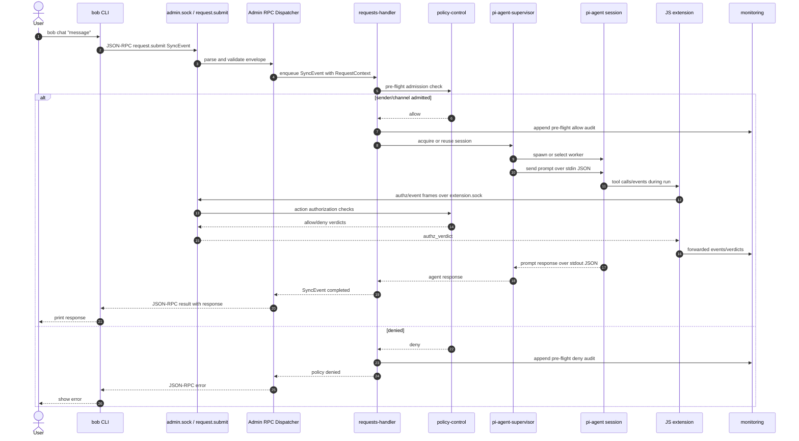
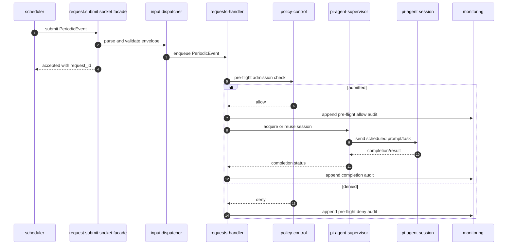
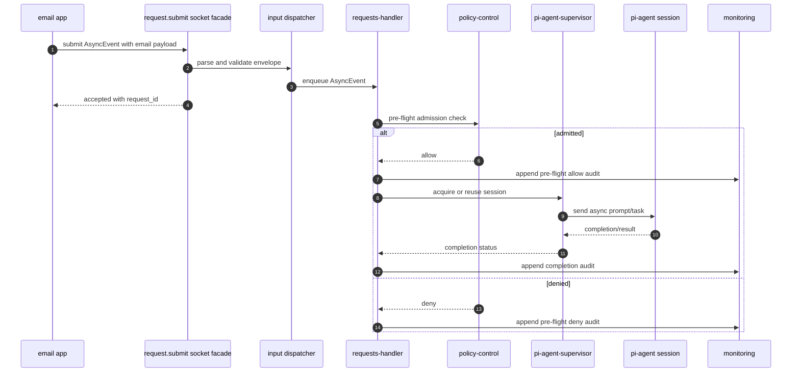

# Service Code Component Diagram

## Current Implementation Notes

- `admin.sock` currently serves admin/reporting JSON-RPC methods such as `service.status`, `sessions.list`, `sessions.kill`, `policy.reload`, audit tail subscription, and `report.submit`.
- `chat.send` is present as a method name but is not implemented.
- `extension.sock` is intended for pi-agent extension traffic: authorization requests and extension events tagged by session.
- `requests-handler` can queue and preflight internal events, then enqueue allowed events into persistence.
- There is not yet a public channel-agnostic `request.submit` socket method that accepts normalized input, starts or selects a pi-agent session, sends a prompt, and optionally returns the agent response.

# Target Input Flow Sequence Diagrams

These sequence diagrams describe the intended next-phase behavior. The generic
`request.submit` facade, channel-agnostic input envelope, request-to-pi-agent
dispatch, and synchronous response routing are not implemented yet.

## CLI Chat With Response

## Periodic Message

## Async Email Event

